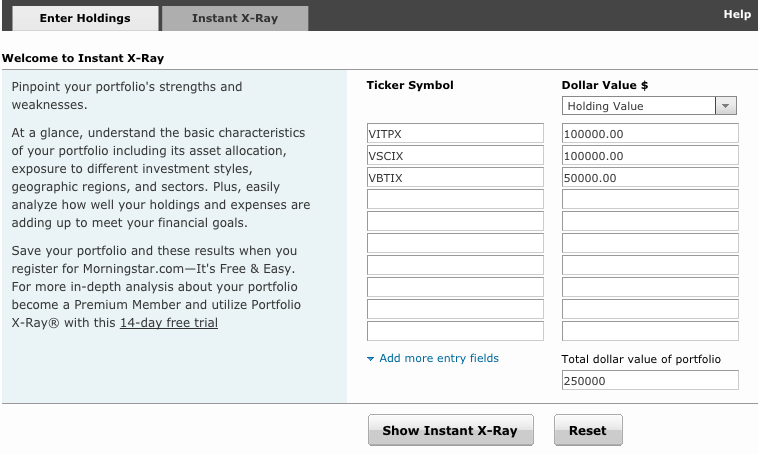
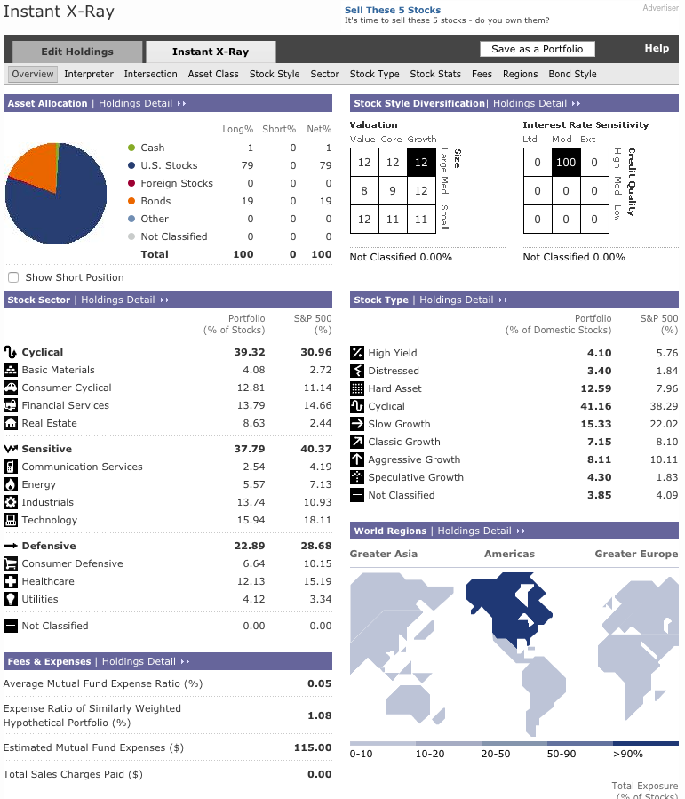

# Introduction

Mutual funds are far from transparent about their holdings.  And we cannot rely on the names of today's funds to tell us what is in each fund.  Fortunately, Morningstar provides tool to help us see what types of investments are instead a portfolio of mutual funds.

# Directions

* Research

    Before you can get started, you will need the list of fund symbols from your brokerage.  For educational purposes, you can use [list of funds](vanguardfunds.html) available to me.

* Open the tool

    Open [Instant X-Ray Tool](http://portfolio.morningstar.com/RtPort/Free/InstantXRayDEntry.aspx) to calculate the cost of owning one or more mutual funds.

* Enter the Symbols

    Enter the symbols of the portfolio you want to examine.

    

* Enter Holding Values

    Enter holding values for each symbol, either as a dollar value or as percentage of your account.
    

* Click on the _Show Instant X-Ray_ button

    

# Understanding the X-Ray

##  Asset Allocation

In the upper left panel, you see the break out by cash, stocks and bonds.  As a general rule, young people start with 80% stocks and 20% bonds.  Those closer to retirement shift more into bonds.
    
    
##  Stock Sector

But, asset allocation is not the entire story.  The second panel on the left breaks out stock holdings by sector.  I'm not sure what the best break out here should be, but I do know you would not want to have too much in anyone one category.  For example, having 80% in energy is probably bad. We will look at other tools to better understand these sectors.
    

## Stock Style

Again, I do not yet know what an ideal allocation between these boxes should be.  In the example shown, I am making the following assumptions:

* Being fairly evenly spread out between value-core-growth and large-med-small is probably a good thing
* Having everyting considered high quality is probably a good thing
* Moderate interest rate sensitive must be good, since we strive for everything in moderation.

##  Stock Type

Yet again, I do not know what a perfect allocation would look like.  But, looking similar to the S&P is probably not a bad thing.

##  World Regions

Given the current turmoil in the world, I'm content with having everything in North America.
