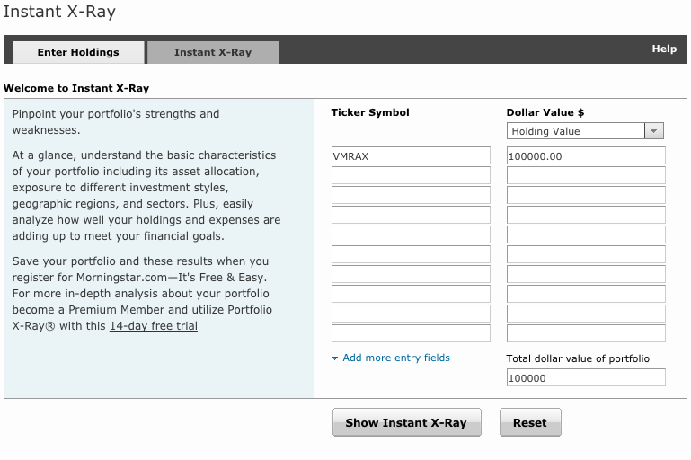

# Introduction

Mutual funds are far from transparent with their fees.  Fortunately, Morningstar provides tool to help us calculate how much it costs to own specific mutual funds.

# Directions

* Research

    Before you can get started, you will need the list of fund symbols from your brokerage.  For educational purposes, you can use [list of funds](vanguardfunds.html) available to me.
    
    
* Open the tool

    Open [Instant X-Ray Tool](http://portfolio.morningstar.com/RtPort/Free/InstantXRayDEntry.aspx) to calculate the cost of owning one or more mutual funds.

    

* Enter a Symbol

    _Instant X-Ray_ was built to look at a portfolio of funds all at once.  If we want to understand the fees of a single fund, we enter one at a time.  For example:

* Enter a Dollar Value

    Since we want to know a dollar value, we must provide a dollar value for our holdings.  If you do not own the mutual fund, I suggest entering either $100,000 or $10,000.  

* Click on the _Show Instant X-Ray_ button

    
    
        The lower this number, the better.  Ideally, we want a ratio that is under 0.5%.  But, under 0.3% is even better.
        
        
    * Estimated Mutual Fund Expenses
    
        This is the dollar value of expenses based on the value you specified.
    

