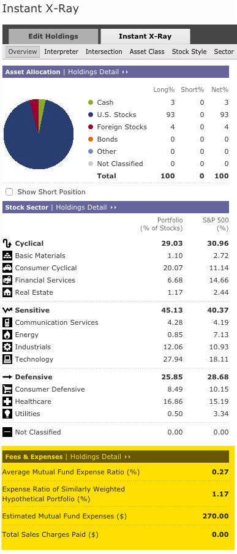

# The Tool

We use [Morningstar's](www.morningstar.com) [Instant X-Ray Tool](http://portfolio.morningstar.com/RtPort/Free/InstantXRayDEntry.aspx) to calculate the cost of owning one or more mutual funds.

# Enter Symbol

_Instant X-Ray_ was built to look at a portfolio of funds all at once.  If we want to understand the fees of a single fund, we enter one at a time.  For example:

then, click on the xray button

## Single Mutual Fund

To calculate the fees of a single mutual, enter a single holding in the [Instant X-Ray Tool](http://portfolio.morningstar.com/RtPort/Free/InstantXRayDEntry.aspx) as follows:

# another heading

## and another
