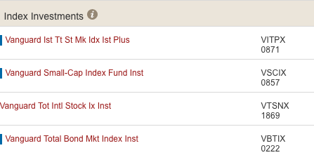
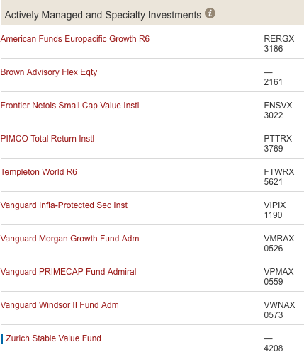

# Introduction

Vanguard makes three types of funds available for my 401K plan.  Each type has different characteristics geared for different goals.

# Types of Funds

##  Index Funds

##  Managed Funds

Note that the Zurich Stable Value Fund functions as a money market account.  That is, each share has a value of close to $1.  There little risk of losing this investment, and close to zero chance of it growing.  Nonetheless, having a money option is a good safe haven when needed.

##  Target Date Funds

I've decided that the target date funds are not for me for the following reasons:

* Research that I've done seemed to indicate that they often failed at meeting their stated objectives.
* Without symbols, I could not find a way to independently verify their cost or performance.

